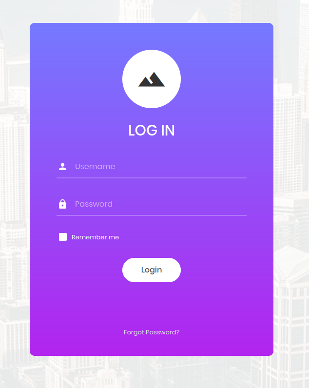
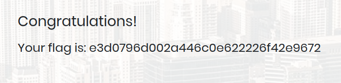

# Appointment

This box is dedicated to showing how to perform simple sql injection attacks and the consequences of poor sanitization to the users security when ignored.

## Recon

The challenge starts off by doing some recon on the machine, You first try to get an idea of what services are running on the open ports by using nmap which gave out this result:

```sh
# Nmap 7.92 scan initiated Sun May  8 13:24:23 2022 as: nmap -sV -sC -Pn -o appointment.txt 10.129.220.2
Nmap scan report for 10.129.220.2
Host is up (1.5s latency).
Not shown: 999 closed tcp ports (reset)
PORT   STATE SERVICE VERSION
80/tcp open  http    Apache httpd 2.4.38 ((Debian))
|_http-server-header: Apache/2.4.38 (Debian)
|_http-title: Login

Service detection performed. Please report any incorrect results at https://nmap.org/submit/ .
# Nmap done at Sun May  8 13:25:15 2022 -- 1 IP address (1 host up) scanned in 52.37 seconds

```

When we look at the open port in a browser we get this page:



Once in the login page we can try some default credentials to see if we can gain access without much effort but no no avail.

## Foothold

However, if we try to perfom an sql injection in the username field by typing `admin'#` along with any text in the password field we gain access to the flag. This vulnerability can be found by utilizing the knowledge discussed in the previous questions in the machine.

