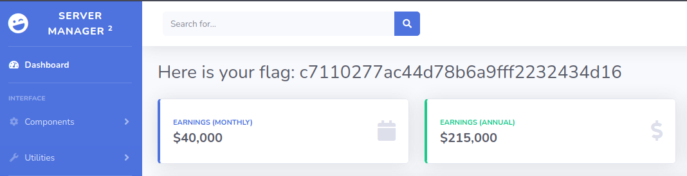

# Crocodile

**Table of Contents**

- [Crocodile](#crocodile)
  - [Questions](#questions)
  - [Recon](#recon)
  - [Foothold](#foothold)

## Questions

**What nmap scanning switch employs the use of default scripts during a scan?**

    -sC

-sC
: Nmap contains scripts for brute forcing dozens of protocols, including http-brute , oracle-brute , snmp-brute , etc. These scripts are the default set and are run when using the -sC or -A options rather than listing scripts with --script.

**What service version is found to be running on port 21?**

    vsftpd 3.0.3 

**What FTP code is returned to us for the "Anonymous FTP login allowed" message?**

    230

**What command can we use to download the files we find on the FTP server?**

    get

get or mget
: Is a tool that can be used to download files or forlders from the ftp server onto the local host for further inspection.

**What is one of the higher-privilege sounding usernames in the list we retrieved?**

    admin

**What version of Apache HTTP Server is running on the target host?**

    2.4.41 

**What is the name of a handy web site analysis plug-in we can install in our browser?**

    wappalyzer

wappalyzer
: Is a plugin that can be used on most chromium based browsers in order to gather further information on what sort of technologies a web app is running and their versions

**What switch can we use with gobuster to specify we are looking for specific filetypes?**

    -x

**What file have we found that can provide us a foothold on the target?**

    login.php

## Recon

When running nmap we found a few open ports with services of interest

```sh
# Nmap 7.92 scan initiated Tue May 10 15:41:56 2022 as: nmap -sV -sC -Pn -oA crocodile 10.129.1.15
Nmap scan report for 10.129.1.15
Host is up (1.0s latency).
Not shown: 998 closed tcp ports (conn-refused)
PORT   STATE SERVICE VERSION
21/tcp open  ftp     vsftpd 3.0.3
| ftp-syst: 
|   STAT: 
| FTP server status:
|      Connected to ::ffff:10.10.14.18
|      Logged in as ftp
|      TYPE: ASCII
|      No session bandwidth limit
|      Session timeout in seconds is 300
|      Control connection is plain text
|      Data connections will be plain text
|      At session startup, client count was 1
|      vsFTPd 3.0.3 - secure, fast, stable
|_End of status
| ftp-anon: Anonymous FTP login allowed (FTP code 230)
| -rw-r--r--    1 ftp      ftp            33 Jun 08  2021 allowed.userlist
|_-rw-r--r--    1 ftp      ftp            62 Apr 20  2021 allowed.userlist.passwd
80/tcp open  http    Apache httpd 2.4.41 ((Ubuntu))
|_http-title: Smash - Bootstrap Business Template
|_http-server-header: Apache/2.4.41 (Ubuntu)
Service Info: OS: Unix

Service detection performed. Please report any incorrect results at https://nmap.org/submit/ .
# Nmap done at Tue May 10 15:43:46 2022 -- 1 IP address (1 host up) scanned in 110.08 seconds
```

As you can see there anonymous login is allowed on the ftp server which could potentially mean a foothold on the box. There is also the Apache web server which we can test in order to find out if an admin login is possible.

Since Anonymous user is allowed we can now proceed to connect to the ftp server and see what we can find.


Once logged in we can see that there are two files named **allowed.userlist** and **allowed.userlist.passwd**, these files can be downloaded back to our local machine for inspection via the `mget` command or alternatively the `get` command.

## Foothold

Now that we have the **allowed.userlist** and **allowed.userlist.passwd**, we can proceed to analize their contents and try them on the web server login page


When we enter the machines IP along with the `/login.php` in our browser we are faced with the web servers login page


By using the username and password lists we retrieved from the ftp server earlier we can try to manually brute-force our way into the servers management dashboard on the other side of the login page.


Once past the login page we can retrieve the flag we were looking for thus completing this box


