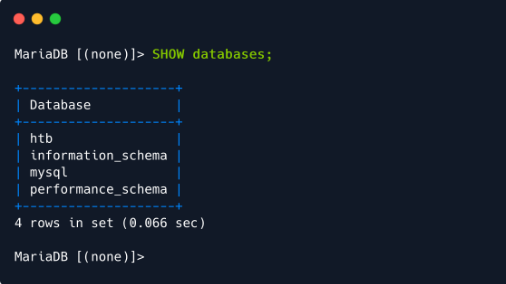
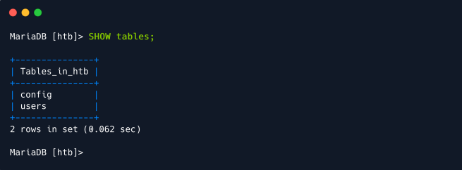
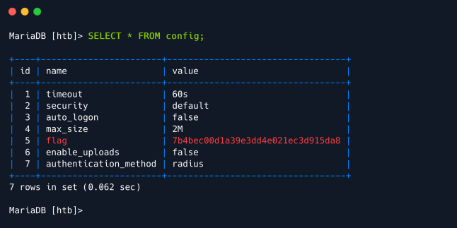

# Sequel

**Table of Contents**

- [Sequel](#sequel)
  - [Questions](#questions)
  - [Recon](#recon)
  - [Foothold](#foothold)

## Questions

**What does the acronym SQL stand for?**

    Structured Query Language 

**During our scan, which port running mysql do we find?**

    3306

**What community-developed MySQL version is the target running?**

    MariaDB

MariaDB
: Is an open source fork of the famous MySQL relational databse made by the very creators of MySQL and it's intended to stay open source permanently. But despite being created and maintained by the same people it supports a much broader range of storage engines compared to it's original and is under the GPL License while MySQL is dual licensed.

**What switch do we need to use in order to specify a login username for the MySQL service?**

    -u

-u
: This switch can be used to specify any user in the MySQL service but if the attacker wishes to try or has access to superuser credentials then they can also use the `-U` for username and `-P` for password and this will tell the service that whoever is trying to access has superuser priviliges.

**Which username allows us to log into MariaDB without providing a password?**

    root

root user
: The root user in mysql doesn't need to have a password in order to log in since it is configured to try to use the _unix_socket authentication plugin_, this allows the root user to bypass authentication since root will typically be connecting via **_root@localhost_** albeit this only works if the the login is attempted from a root owned process. This type of authentication can also be viewed in more advanced LFI (Local File Inclusion) attacks.

**What symbol can we use to specify within the query that we want to display everything inside a table?**

    *

**What symbol do we need to end each query with?**

    ;

## Recon

When running nmap to see what services were running on the machines open ports we found a mysql instance on port 3306, we also found MariaDB running and where we will try to gain our initial access into the box by using the root user which doesn't need a password.

```sh
# Nmap 7.92 scan initiated Sun May  8 16:02:41 2022 as: nmap -sV -sC -Pn -oA nmap-sequel 10.129.93.199
Nmap scan report for 10.129.93.199
Host is up (0.72s latency).
Not shown: 999 closed tcp ports (conn-refused)
PORT     STATE SERVICE VERSION
3306/tcp open  mysql?
|_ssl-date: ERROR: Script execution failed (use -d to debug)
|_tls-alpn: ERROR: Script execution failed (use -d to debug)
|_ssl-cert: ERROR: Script execution failed (use -d to debug)
| mysql-info: 
|   Protocol: 10
|   Version: 5.5.5-10.3.27-MariaDB-0+deb10u1
|   Thread ID: 67
|   Capabilities flags: 63486
|   Some Capabilities: SupportsTransactions, SupportsLoadDataLocal, IgnoreSpaceBeforeParenthesis, Support41Auth, ODBCClient, IgnoreSigpipes, InteractiveClient, SupportsCompression, DontAllowDatabaseTableColumn, Speaks41ProtocolNew, FoundRows, Speaks41ProtocolOld, LongColumnFlag, ConnectWithDatabase, SupportsMultipleStatments, SupportsAuthPlugins, SupportsMultipleResults
|   Status: Autocommit
|   Salt: Gi[j&zX'Yl2U3A+TD9/"
|_  Auth Plugin Name: mysql_native_password
|_sslv2: ERROR: Script execution failed (use -d to debug)

Service detection performed. Please report any incorrect results at https://nmap.org/submit/ .
# Nmap done at Sun May  8 16:08:44 2022 -- 1 IP address (1 host up) scanned in 363.23 seconds
```

## Foothold

There is no web login to be founld so we must attempt to gain access via terminal using the mysql command.

> 💡**Tip:** If you don't have or are not sure if you have mysql installed on your machine you can always install it via
> `sudo apt install mysql-common`

Then you have to use the flags in order to connect to the database using the -h {machine **IP**} and -u {user in this case **root**}. Once you gain acces you can use the \h command in order to orient yourself on which commands you have available in the database. Now we try to see what databases are currently in the server and their tables



Using the **htb** database we see that there are two tables we case utilize to find our flag



Once here all that's left is to check each table one by one in order to find the flag we're looking for which can be found in the **config** table which we can copy and submit over to HackTheBox completing this box.

  
